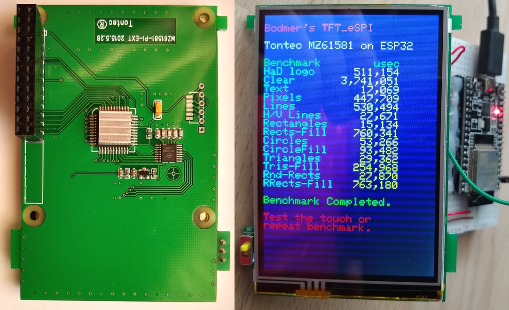
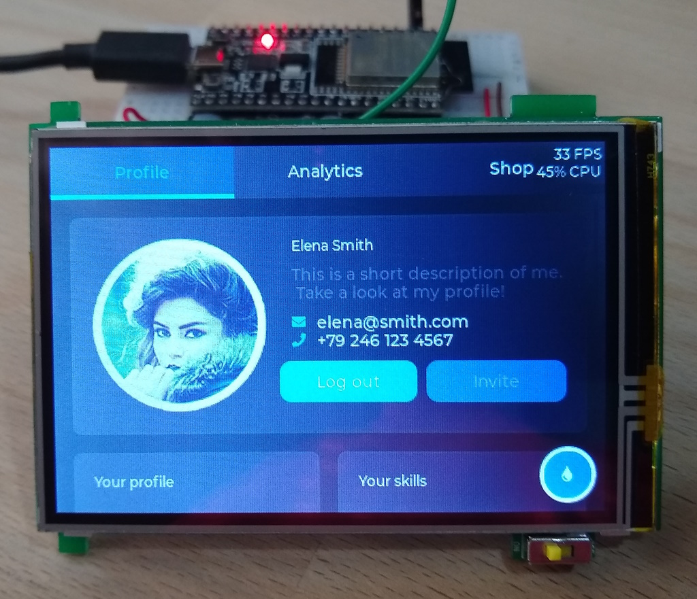
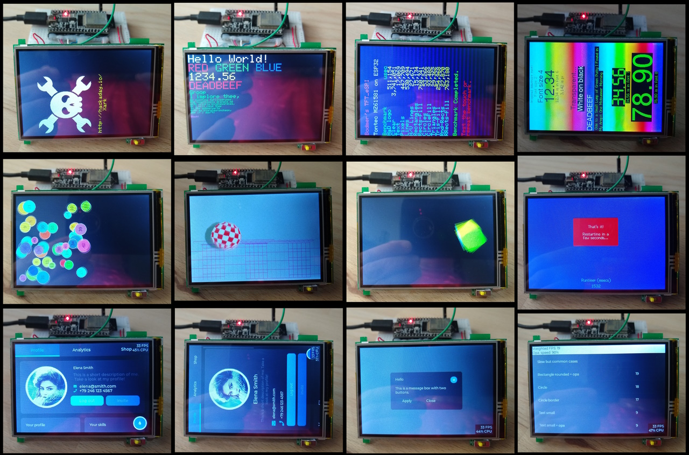
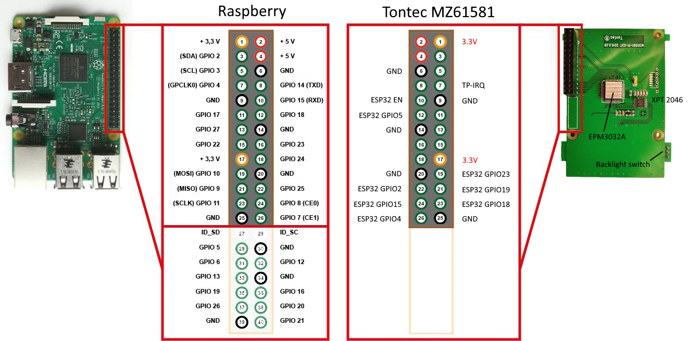
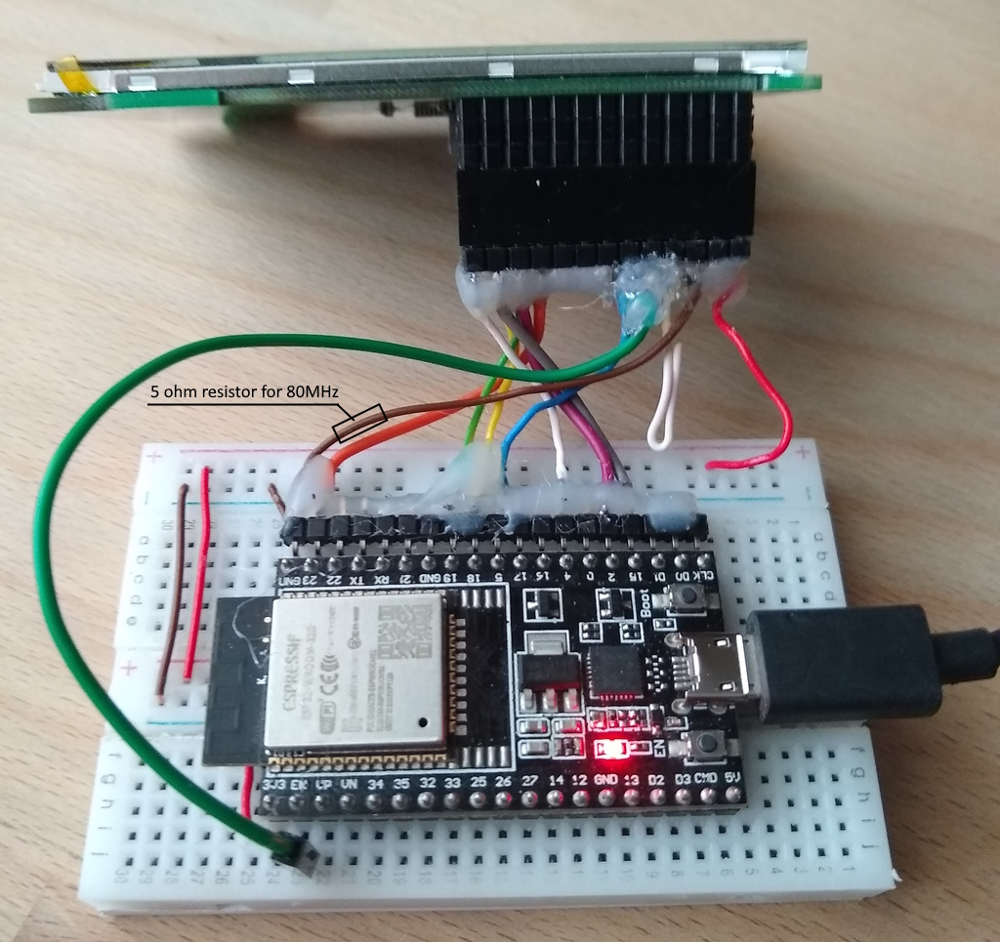

# Raspberry Touch Display MZ61581 3.5" 480x320 XPT2046
SPI Display Tontec MZ61581 , tested with an ESP32 DevKitC V4 and Arduino IDE 2.1.1 ( or PlatformIO  )

- Display Tontec MZ61581-PI-EXT 2015.5.28
  - Display controller R61581
  - Touch controller XPT2046
  - Altera EPM3032A

Display works fine with [TFT_eSPI 2.5.31](#espi) and LVGL 8.3.10

The display works stable with 27MHz. 40MHz requires short cables. 80MHz works with a 10 ohm resistor between ESP32-GND and MZ61581-GND, which increases the GND voltage of the display to 0.47V. Display draws about 72mA.

Speed (27MHz/40MHz/80MHz) : Bouncy_Circles 22/32/64fps, boing_ball 83/105/140fps, Sprite_Rotating 100/150/300fps.







## Connections for ESP32 DevKitC V4

SPI MOSI, MISO and CLK are used for Display and Touch.

| ESP32 GPIO | RPI/MZ61581 | RPI GPIO | TFT_eSPI | Description    |
| ----: | :------ | -------: | :------- | :------------- |
| 23    | MOSI    | 10       | TFT_MOSI | SPI MOSI       |
| 19    | MISO    |  9       | TFT_MISO | SPI MISO       |
| 18    | SCLK    | 11       | TFT_SCLK | SPI SCLK       |
|  2    | GPIO25  | 25       | TFT_DC   | DC             |
| EN    | GPIO15  | 15       | TFT_RPI  | RST            |
| 15    | CE0     |  8       | TFT_CS   | SPI CS (TFT)   |
|  4    | CE1     |  7       | TOUCH_CS  | SPI CS (Touch) |
|  5    | GPIO18  | 18       | TFT_BL   | Backlight PWM  |
|       | GPIO4   |  4       |          | Touch IRQ (not used) |
|       | GND     |          |          | GND            |
|       | 3V3     |          |          | 3.3V           |

Connections :


With longer cables (15cm), only 27MHz were stable.


Many examples of the TFT_eSPI library are working fine except "TFT_ReadWrite_Test.ino" :
````
 Pixel value written = 800
 Pixel value read    = FFFF
 ERROR                 ^^^^
````
Same problem as with the similar ili9488 controller ?

## Quick installation
- Arduino :
  - Install the libraries "TFT_eSPI" and "lvgl".
  - Copy the program file(s) from the folder "Arduino" and especially "Arduino/libraries", which contain all configuration files.
  - Copy the folder "Arduino\libraries\lvgl\demos" to "Arduino\libraries\lvgl\ **src**\demos"
  - Copy the folder "Arduino\libraries\lvgl\examples" to "Arduino\libraries\lvgl\ **src**\examples".
- Test/Benchmark : [R61581_TFT_graphicstest](/Arduino/R61581_TFT_graphicstest/R61581_TFT_graphicstest.ino)
- Touch calibration : [R61581_Touch_calibrate](/Arduino/R61581_Touch_calibrate/R61581_Touch_calibrate.ino)
- LVGL Demo : [R61581_LVGL](/Arduino/R61581_LVGL/R61581_LVGL.ino)


## Configuration of the library TFT_eSPI 2.5.31 <a name="espi"></a>
- Configuration files : 
  - Arduino/libraries/TFT_eSPI/User_Setup_Select.h 
  - Arduino/libraries/Setup405_MZ61581.h

User_Setup_Select.h :
```java
...
///////////////////////////////////////////////////////
//   User configuration selection lines are below    //
///////////////////////////////////////////////////////

// Only ONE line below should be uncommented to define your setup.  Add extra lines and files as needed.

// Comment the following line, if you want to use custom setup file
//#include <User_Setup.h>                  // Default setup is root library folder

// Setup file in folder Arduino/libraries (updates will not overwrite your setups)

#include <../Setup405_MZ61581.h>           // new : Setup file for  R61581 3.5" RPI Touch Display 
...
```
User_Setup.h :

```java
#define USER_SETUP_ID 405

// Driver

#define R61581_DRIVER

#define TFT_WIDTH  320
#define TFT_HEIGHT 480

// Pins

#define TFT_BL    5           // Backlight LED control pin
#define TFT_BACKLIGHT_ON LOW  // Level to turn ON back-light (HIGH or LOW)

#define TFT_CS   15     // Chip select control pin
#define TFT_DC    2     // Data Command control pin
#define TFT_RST  -1     // Set TFT_RST to -1 if the display RESET is connected to NodeMCU RST or 3.3V

//#define TFT_MISO 19   // default pins ESP32
//#define TFT_MOSI 23   // dito
//#define TFT_SCLK 18   // dito

#define TOUCH_CS 4      // Chip select pin (T_CS) of touch screen

// Fonts
#define LOAD_GLCD       // Font 1. Original Adafruit 8 pixel font needs ~1820 bytes in FLASH
#define LOAD_FONT2      // Font 2. Small 16 pixel high font, needs ~3534 bytes in FLASH, 96 characters
#define LOAD_FONT4      // Font 4. Medium 26 pixel high font, needs ~5848 bytes in FLASH, 96 characters
#define LOAD_FONT6      // Font 6. Large 48 pixel font, needs ~2666 bytes in FLASH, only characters 1234567890:-.apm
#define LOAD_FONT7      // Font 7. 7 segment 48 pixel font, needs ~2438 bytes in FLASH, only characters 1234567890:.
#define LOAD_FONT8      // Font 8. Large 75 pixel font needs ~3256 bytes in FLASH, only characters 1234567890:-.
//#define LOAD_FONT8N     // Font 8. Alternative to Font 8 above, slightly narrower, so 3 digits fit a 160 pixel TFT
#define LOAD_GFXFF      // FreeFonts. Include access to the 48 Adafruit_GFX free fonts FF1 to FF48 and custom fonts

#define SMOOTH_FONT

//#define SPI_FREQUENCY   20000000
//#define SPI_FREQUENCY   27000000  // ok
#define SPI_FREQUENCY     40000000  // ok with short cables
//#define SPI_FREQUENCY   80000000  // white screen

#define SPI_TOUCH_FREQUENCY 2500000
// #define SUPPORT_TRANSACTIONS
```
